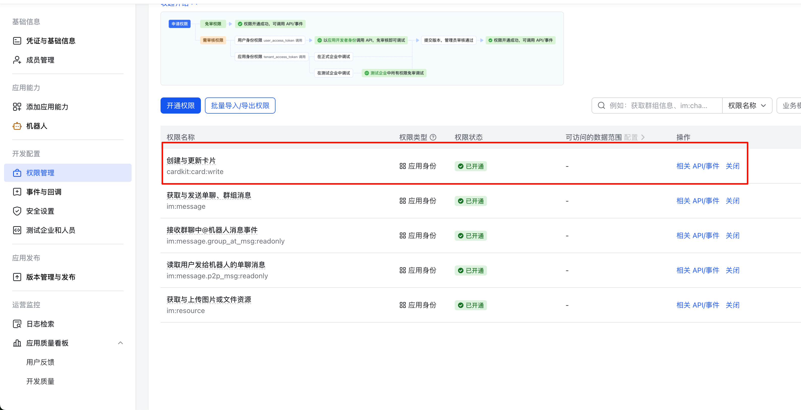
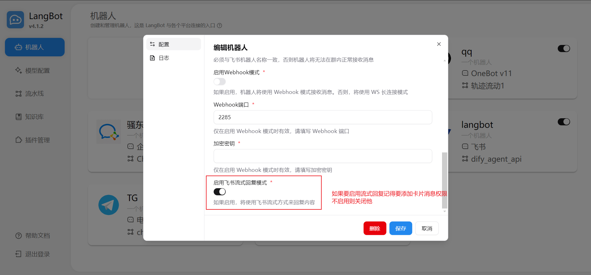

## ボットの作成

[Feishu Open Platform](https://open.feishu.cn/app)にアクセスし、ログインして、企業の自己構築アプリケーションまたはストアアプリケーションを作成します。[(違いの紹介)](https://open.feishu.cn/document/platform-overveiw/overview)

アプリケーションにボット機能を追加します：

権限管理で画像に示されている権限を追加します：

カードストリーミング権限が必要な場合は、画像に示されている次のカード作成と更新権限を追加します：

<Warning>
デフォルトのカードテンプレートを変更する必要がある場合は、プラットフォームアダプターのコードでカードテンプレートを自分で修正する必要があります。
</Warning>

## LangBot に接続

「認証情報と基本情報」ページで `app_id` と `app_secret` を見つけます。

LangBot の Webui 設定ページを開き、新しいボットを作成します

フォームに関連情報を入力します

ストリーミング関連：

入力後、LangBot を起動します。設定が成功した場合、ログに `[01-29 23:42:56.796] manager.py (68) - [INFO] : Initializing platform adapter 1: lark` と表示されます。LangBot を実行し続けてください。

<Warning title="デフォルトでは、WebSocket 長時間接続モードが使用されます。これは以下の長時間接続サブスクリプションに対応しています。ただし、場合によっては（国際版の Feishu など）、長時間接続モードが利用できない場合があります。その場合は、Webhook モードを使用する必要があります。これは、「開発者サーバーにイベントを送信」モードに対応しています。次の設定を参照してください：">

- `enable-webhook`：`true` に設定
- `encrypt-key`：「イベントとコールバック」ページの「暗号化戦略」の「Encrypt Key」に設定

Webhook モードでは、LangBot をパブリック IP を持つサーバーにデプロイし、ファイアウォールが上記で設定したポートを開いていることを確認する必要があることに注意してください。

<Tip>
**パブリックサーバーがありませんか？** [LangBot Cloud](https://space.langbot.app/cloud) にはドメインと HTTPS が含まれており、Lark ボットをすぐに使用できます。
</Tip>
</Warning>

## イベントサブスクリプションの設定

「イベントとコールバック」ページに移動し、サブスクリプション方式を「長時間接続」として設定します：

そして、イベント：「メッセージを受信」を追加します

<Warning title="Webhook モード設定方法：">

まず LangBot を起動してください。ここにサーバーアドレスとポートを入力します。パスは `/lark/callback` です。「保存」をクリックします。

</Warning>

## ボットの公開

上部の「バージョンを作成」をクリックし、バージョン番号とその他の情報を入力し、下部の「保存」をクリックします。

ボットを Feishu グループに追加して使用します：

プライベートチャットでも直接使用できます

## よくある問題
- ストアアプリのボットは、作成/保存直後にチャットメッセージに応答できません。[app_ticket イベント](https://open.feishu.cn/document/server-docs/application-v6/event/app_ticket-events)の遅延メカニズムにより、正常に動作するまで約 2 分待つ必要があります。
