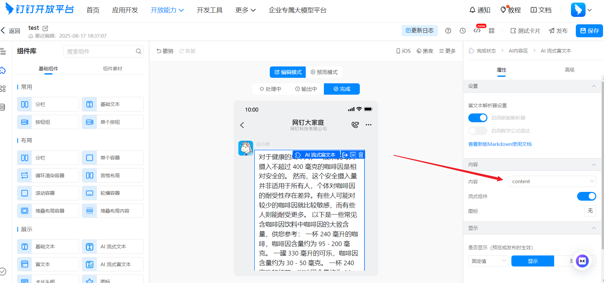
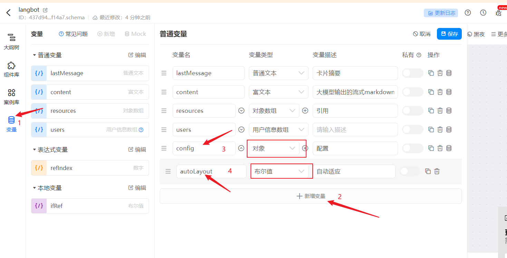

部署 LangBot 到钉钉。

## 创建机器人

进入 [钉钉开发者后台](https://open-dev.dingtalk.com/?spm=ding_open_doc.document.0.0.74f445e5MkawbT#/)，登录并且进入组织。登录成功后进入开放平台，是这样的：

点击上方的 `应用开发`,然后点击右面蓝色的按钮 `创建应用`，填写机器人的基本信息，点击保存。

进入机器人的后台，比如我们有机器人 langbot2 ,那么它的管理页面是这样的：

## 配置机器人

点击 `添加应用能力`，`其他应用能力`，`机器人`中的 `配置`，点击配置并且填写信息之后，如下图：

点击页面下方的`发布`，发布成功之后，点击机器人页面中左侧最下方的`版本管理与发布`，如图：

如果是第一次创建机器人，那么右边是空的，需要点击`创建新版本`，在其中设置信息，然后设置`应用可见范围`，点击保存。

点击`事件订阅`，将其中的推送方式改为`Stream模式推送`。

如果需要卡片流式，则需要在权限管理中申请卡片权限，如图:

另外卡片消息主要创建卡片模板，并记录模板id填入配置信息，流程如下：
> 卡片内容模板ID，可通过登录开发者后台 > [卡片平台](https://open-dev.dingtalk.com/fe/card?spm=ding_open_doc.document.0.0.33cf2281L0fXsV)获取

新建模板填写信息，如图：

选择预设模板（直接选第一个然后进去后更改模板内容），如图：

点击使用

创建

点击创建后会跳转到编辑模板。如图，这样你就可以尽情的编辑你想要的卡片消息了：

主内容这里默认content不要改动即可：

宽屏配置参数，需要在模板变量中添加.参考[钉钉宽屏配置](https://open.dingtalk.com/document/development/configure-widescreen-cards)

编辑好没问题之后保存即可，并复制模板id用以填写配置文件：

## 填写配置信息

点击`凭证与基础信息`，记录`Client ID` 和 `Client Secret`，
点击`应用能力`，`机器人`，记录下 RobotCode 和 机器人名称。
`markdown_card` 为是否启用 Markdown 形式的回复，当此配置项关闭时，`@发送者` 配置开关不会生效。
将以上配置项 记录下来，填到 LangBot 机器人配置表单中。

点击[卡片平台](https://open-dev.dingtalk.com/fe/card?spm=ding_open_doc.document.0.0.33cf2281L0fXsV)模板列表复制绑定的对应的模板id填入卡片模板id

流式相关：

**启动 LangBot** 。

## 添加机器人

本文使用钉钉 windows 桌面版举例，点击上方的`搜索`，`功能`，然后输入刚才机器人创建的名称，如图：

点击机器人即可和机器人聊天。

如果想要添加到群里，那么点击钉钉群的`群管理`，`机器人`，`添加机器人`，然后搜索机器人名称就可以在群中使用。
